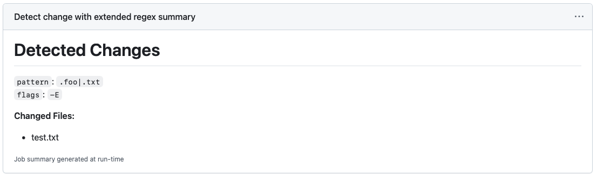
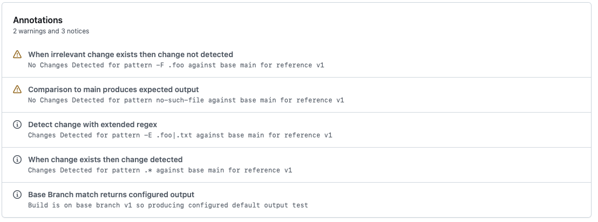

# Detect Changes Action

This repository provides a GitHub Action that performs change detection to determine whether any relevant changes, as
defined by a `grep` pattern applied to `git diff --name-only` output, exist in your current reference.

This is useful if you want to make some aspects of a workflow configurable based upon what files have actually changed.
This differs from GitHub Actions built in [`path`][PathFilters] support in that this allows your workflow to be
triggered for any push but then further customise what jobs/job steps run based on the outcome of change detection.

For example if you were building a Java based project you might want to skip tests if no Java or build files have been
changed:

```yaml
name: Conditional Testing Example
on:
  push:

jobs:
  example:
    runs-on: ubuntu-latest
    permissions:
      contests: read

    steps:
      - name: Checkout
        uses: actions/checkout@v7

      - name: Setup Java
        uses: actions/setup-java:5.2.0
        with:
          java-version: 21
          distribution: temurin
          cache: maven

      - name: Detect Java Changes
        id: java-changes
        uses: rvesse/detect-changes-action@v1
        with:
          base: main
          pattern: .java|pom.xml
          flags: -E
          # If the base reference and current reference are identical then changes aren't detected then this output is
          # returned instead.  For this example we always want to run tests on our base branch main so we set this to 
          # true
          output-on-base: true 

      - name: Maven Build
        shell: bash
        # Here we use the output from this action to inject the -DskipTests flag if no Java changes were detected
        run:
          mvn clean install ${{ case(steps.java-changes.outputs.changed == 'false', '-DskipTests', '') }}
```

# Requirements

**IMPORTANT:** This action assumes that your workflow has checked out the reference that you want to detect changes in
versus the given `base` branch.

For most workflows this means using the [`actions/checkout`][CheckoutAction] action.

# Inputs

| Input            | Required? | Default | Purpose |
|------------------|-----------|---------|---------|
| `base`           | False     | `main`  | Indicates the base branch/reference against which changes should be detected. |
| `pattern`        | True      |         | Provides the `grep` pattern that is applied to the `git diff` output to determine if any changes are considered relevant . |
| `flags`          | False     |         | Provides any flags to pass to `grep` to configure how it treats the `pattern` input. |
| `output-on-base` | False     | `true`  | Provides the value to return in the `changed` output if run on the configured `base` branch. |
| `summary`        | False     | `true`  | The relevant changes detected will be added to the job summary if set to `true`. |
| `notices`        | False     | `true`  | GitHub Actions notices and warnings will be generated if set to `true`. |

## The `base` branch/reference

The `base` input specifies the branch/reference that the current reference in your workflow (as checked out/modified by
earlier steps in your workflow) is compared against.

The actual comparison is done using `git diff --name-only origin/<base>` so the `base` input **MUST** be a branch
reference.  This produces a temporary file in the Actions `runner.temp` directory containing the list of changed files,
this temporary file is removed after relevant change detection has happened.

## The `pattern` and `flags` inputs

Once the `git diff` has been computed vs the [`base`](#the-base-branchreference) this action then `grep`'s the resulting
diff, which will be a list of file paths, to determine whether any relevant changes exist.  The `flags` and `patterns`
inputs are used to configure the `grep` command that is run.

For example `pattern: .java|pom.xml` on its own would not match both `.java` and `pom.xml` files because `|` is not
treated as a meta-character in basic `grep` regular expressions.  You either need to use `pattern: .java\|pom.xml` or
use `pattern: .java|pom.xml` and `flags: -E` to use extended `grep` regular expressions.

## The `output-on-base` input

If this action runs on a reference that is the same as the [`base`](#the-base-branchreference) then by definition there
cannot be any changes and the `git diff` and `grep` are skipped.

Instead the action returns the value of the `output-on-base` input as the [`changed`](#outputs) output.  This allows
workflows to distinguish between cases of actual change detection, versus cases where no change detection is possible.

## The `summary` input

The `summary` input controls whether this action will add a [job summary][JobSummary] when it runs, this defaults to
`true` meaning it is enabled by default.  This can be disabled by setting to any other value.

An example summary looks like the following:



The summary is useful when you initially adopt the action to help debug what changed files were detected and help you
refine your [`pattern`](#the-pattern-and-flags-inputs) appropriately for your workflow.  However once you have
established that your pattern is correctly configured it may be preferable to disable this, especially if your workflow
calls this action multiple times.

## The `notices` input

The `notices` input controls whether this action will produce GitHub Actions notices and warnings that will be added to
your build summary, this defaults to `true` meaning it is enabled by default.  If you prefer for these not to be issued
then disable it by setting it to any other value.

Example notices are like so:



If your workflow calls this action many times this may get quite messy and it may be preferable to disable these.

# Outputs

This action has a single `changed` output that may have one of three possible values:

1. `true` if changed files matching your `pattern` input were detected relative to the `base` branch
2. `false` if no changed files matching your `pattern` input were detected relative to the `base` branch
3. The value of the `output-on-base` input if the action was run on your configured `base` branch

[CheckoutAction]: https://github.com/actions/checkout
[PathFilters]: https://docs.github.com/en/actions/reference/workflows-and-actions/events-that-trigger-workflows#running-your-workflow-only-when-a-push-affects-specific-files
[JobSummary]: https://docs.github.com/en/actions/reference/workflows-and-actions/workflow-commands#adding-a-job-summary
